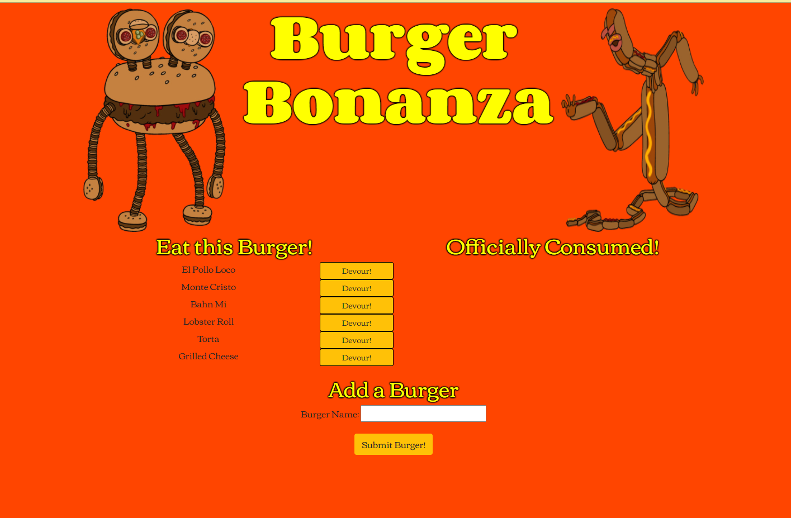

# Burger-Bonanza


 Burger Bonanza! is a restaurant app that lets users input the names of burgers they'd like to eat. Whenever a user submits a burger's name, the app will display the burger on the left side of the page -- waiting to be devoured. Each burger in the waiting area also has a `Devour!` button. When the user clicks it, the burger will move to the right side of the page. The app will store every burger in a database, whether devoured or not.



## Usage

The application will be invoked with the following command:
```
node server.js
```
## Technologies

[Node](https://nodejs.org/en/) was used on the backend to execute JavaScript Code outside the web browser. 

[MySQL](https://www.mysql.com/) was used to organize and manage the data held within the database. 

[Express](https://expressjs.com/) web framework was used to create routes, create route handlers, handle errors, serve static files, as well as use middleware for additional request processing. 

[Handlebars](https://handlebarsjs.com/) was used as the template engine for serving static HTML template files in the application.

## Credits

A link to the [Burger Bonanza](https://whispering-anchorage-18340.herokuapp.com/) application is deployed on Heroku. 

A link to my [Burger Bonanza](https://github.com/nikolaslenning/Burger-Bonanza) is hosted on Github.

This application was authored by [Nikolas Lenning](https://github.com/nikolaslenning).
